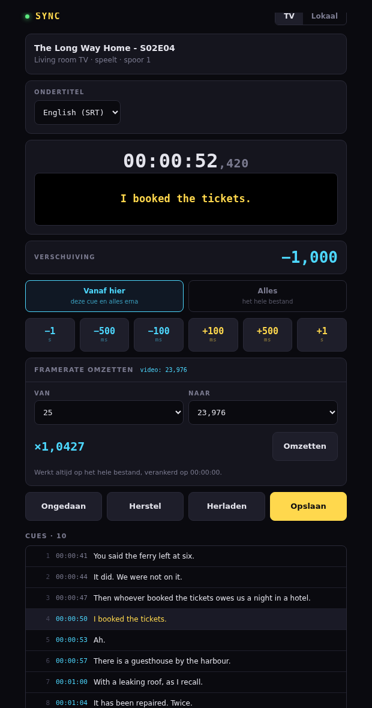

# Live subtitlesync

Subtitles that run ahead or behind, fixed while the film is playing. You watch,
you hear the line, you nudge — and the page writes the corrected file back.



**It works next to a player, not instead of one.** The film runs on the TV
through Jellyfin, or you open the audio track in the browser. This page follows
along, shows the subtitle line that belongs to the moment you are hearing, and
lets you shift it until word and sound meet. There is no automatic detection:
**you tune by ear**, which is why the current line is shown large and why the
buttons go down to a tenth of a second.

## What it does

- **Two sources.** Follow the Jellyfin session on the TV, or open the audio
  locally and scrub through it.
- **Nudge.** ±1 s, ±½ s, ±0.1 s, from the current cue onward or over the whole
  file. Arrow keys work: ←/→ 0.1 s, ↑/↓ 1 s.
- **Undo**, then **Save** — the old file is kept as a backup first.
- **Reload on TV** after saving, so the player picks up the new file at the same
  position.
- **Framerate conversion.** A 25 fps subtitle against a 23.976 fps film drifts
  further apart the longer it runs; converting rescales the whole file at once.
- **Audio on request**, not by default: a *Geluid uitpakken* button loads the
  track when you want to listen in the browser. Most of the time the sound is
  already coming from the TV, so extracting it on every file opened would be
  work for nothing. Audio Chrome cannot play is re-encoded to AAC with a
  progress bar; anything already playable is copied straight through.
- **Nudge subtitles embedded in an MKV**, not just loose `.srt` files: pick a
  track, fix the timing, save it back into the container.
- **Convert to MKV.** A video with a loose `.srt` next to it becomes one MKV
  with the subtitle built in, without re-encoding, so the collection ends up
  in one shape.

## Install

Runs as an ordinary user, not as root — the service may overwrite subtitle
files. **`jan` and `family` below are an example**: use whatever account you
have and whatever group owns the media share. Needs `ffmpeg` for `ffprobe` and
the AAC conversion.

**Why a group.** The films and subtitles all belong to one group — `family`,
gid 1005 say — and only its members may write there. So the account does not
own the files; it joins that group. Inside a container the *number* is what
counts: gid 1005 there must be gid 1005 on the host, or the share reads as
nobody and saving fails. That makes the account uid 1001, gid 1005.

**As root, once:**

```bash
apt update && apt install -y git python3-venv ffmpeg mkvtoolnix

# The group first, with the gid the share already uses.
getent group family || groupadd -g 1005 family

# Then the account. Second line instead of the first if it already exists.
id jan || useradd -u 1001 -g family -m -s /bin/bash jan
usermod -aG family jan

id jan                       # check: uid=1001 gid=1005(family)
install -d -o jan -g family /opt/subtitle-sync
```

`mkvtoolnix` here is the CLI package (`mkvmerge`, `mkvextract`); the GUI
package (`mkvtoolnix-gui`) is not needed and drags in a desktop toolkit.
Version 68 or newer has the current flag names (`--default-track-flag`
instead of `--default-track`); below 50 the MKV features are refused
outright. Check what you got with `mkvmerge --version`.

**A locale quirk, not a bug to fix.** mkvtoolnix aborts on a locale it
doesn't recognize (`std::runtime_error … locale::facet::_S_create_c_locale`),
which happens on a bare `LANG=C` — exactly what a systemd unit's environment
tends to be. The code already sets `LC_ALL=C.UTF-8` on every `mkvmerge`/
`mkvextract` call for that reason; nothing needs to be done for it here, it
is just worth knowing so nobody "fixes" it by removing that.

`groupadd -g` and `useradd -u` are where the numbers come from. Pick the gid
that the media share already uses — `ls -n` on it shows the number — rather
than letting the system choose one.

**As that user:**

### Getting the files there

Two ways. The directory must be empty either way.

Do this as the service account, not as root — files cloned by root are owned by
root and the service cannot build its virtualenv. Cloned as root anyway?
`chown -R jan:family /opt/subtitle-sync` puts it right.

**A — clone, if the machine has a key GitHub knows.** Check with
`ssh -T git@github.com`; it should answer with the repository name. It has none?
Make one and register it as a **read-only deploy key** on this repository
(Settings → Deploy keys), which is scoped to this repo alone:

```bash
ssh-keygen -t ed25519 -C "$(hostname) subtitle-sync" -f ~/.ssh/id_ed25519 -N ""
cat ~/.ssh/id_ed25519.pub        # paste this into the deploy key
```

**B — copy from a machine that already has the files.** No key needed on the
target. Run this on the machine that has the checkout:

```bash
rsync -a --exclude .venv --exclude .git \
      /path/to/subtitle-sync/ jan@<host>:/opt/subtitle-sync/
```

`--exclude .venv` matters: a virtualenv carries absolute paths in
`pyvenv.cfg` and in every shebang under `bin/`, so a copied one does not run.
Build it on the target instead, as the next step does.

**As that user:**

```bash
su - jan
cd /opt/subtitle-sync
# Mind the trailing dot: without it git makes a sync/ subdirectory and every
# step below then fails on a file that is one level down.
git clone git@github.com:Forsskieken/sync.git .    # route A only

python3 -m venv .venv && .venv/bin/pip install -r requirements.txt
cp subtitle-sync.env.example subtitle-sync.env && chmod 600 subtitle-sync.env
nano subtitle-sync.env             # Jellyfin URL and API key
exit
```

**As root again, to start it:**

```bash
cd /opt/subtitle-sync
cp subtitle-sync.service.example       /etc/systemd/system/subtitle-sync.service
cp subtitle-sync-clean.service.example /etc/systemd/system/subtitle-sync-clean.service
cp subtitle-sync-clean.timer.example   /etc/systemd/system/subtitle-sync-clean.timer
nano /etc/systemd/system/subtitle-sync.service    # User, Group, ReadWritePaths
systemctl daemon-reload
systemctl enable --now subtitle-sync subtitle-sync-clean.timer
systemctl status subtitle-sync --no-pager
journalctl -u subtitle-sync -f
```

The timer empties the audio cache nightly; the service rebuilds what it needs.
Keep `CACHE_DIR` out of `/tmp`: `PrivateTmp=yes` gives the service a `/tmp` of
its own, so a cleaner running outside it would empty the wrong directory and the
real cache would grow unseen. `CacheDirectory=subtitle-sync` puts it in
`/var/cache/subtitle-sync` instead, owned by the service account.

`ReadWritePaths=` in the unit must list the same directories as `ALLOWED_ROOTS`
in the env file. Everything else is read-only, so a mismatch shows up as
"Read-only file system" when saving.

Then open `http://127.0.0.1:8099/`. It listens on the loopback only, so reach it
over an SSH tunnel: `ssh -L 8099:127.0.0.1:8099 jan@<host>`.

The user needs read and write access to everything under `ALLOWED_ROOTS`.

## Embedded subtitles

- The track picker lists embedded tracks alongside loose `.srt` files. Pick
  one, load it, nudge it like any other track, then save it back into the
  container.
- A SubRip track (`S_TEXT/UTF8`) edits directly. ASS/SSA/WebVTT tracks can be
  edited too, but only by replacing them with SubRip on save — styling and
  positioning are lost, and the page asks an extra confirmation first. PGS and
  VobSub (picture subtitles) are shown but not editable, since there is no
  OCR; they pass through untouched.
- Safety order, always: mux into a hidden `.<name>.syncpart` chunk **in the
  same directory** as the original, check it (track counts, duration, cue
  count and text), only then swap it in atomically. Any failed check leaves
  the original untouched.
- **No backup is kept once a save succeeds** — the check beforehand is the
  safeguard, not a copy afterwards. Close the file in the player first: one
  still holding it open can make the atomic swap fail.

## Converting to MKV

- The button for the file you have open (`Naar MKV omzetten` for a loose
  `.srt` next to a non-MKV video, `Ondertitel inbouwen` when it's already an
  MKV) does one file, in two confirming taps, with the same safety order as
  above.
- `convert.py` does the rest of the collection from the command line: `scan`
  only reports; `run` without `--apply` is a dry run too and writes nothing.
  Only `run --apply` touches files. See `convert.py --help`.
- `convert.py` needs the **same** `ALLOWED_ROOTS` and `CACHE_DIR` as the
  running service — its lock file must point at the same place, or two
  rewrites of the same file could run at once. Source the service's env file
  before running it: `set -a; . ./subtitle-sync.env; set +a`. The JSON values
  in that file must be wrapped in single quotes for this to work — a shell
  strips bare double quotes and leaves invalid JSON, where systemd would not.
  The example file shows the form.
- The loose `.srt` is kept next to the video after embedding, unless
  `--drop-srt` is given.

## Subtitle language

- The language comes from the filename suffix: `film.nl.srt`, `film.eng.srt`,
  `film.Dutch.srt`.
- `dut` and `nld` are the same language to this tool. mkvmerge fills its own
  IETF language field, so a track this tool writes reads back correctly even
  though the older three-letter field comes back as the B-code (`dut`).
- `.forced`, `.sdh`, `.hi` and `.cc` are markers, not languages — so `.hi`
  means hearing impaired, not Hindi. Write `.hin` if you mean Hindi.
- A file whose language can't be determined is asked about in the browser
  (tap a tile) and skipped in a bulk run, unless `--lang <code>` is given.

Chunks left behind by a crash — `.<name>.syncpart` or `.<name>.syncold` — are
safe to delete by hand; the original video is never touched until a chunk has
passed every check.

## Configuration

All of it comes from `subtitle-sync.env`, which is mode 600 and never committed.

| Variable | Meaning |
|---|---|
| `JELLYFIN_URL` | Base URL of the Jellyfin server |
| `JELLYFIN_API_KEY` | Jellyfin API key. The only secret |
| `PATH_MAP` | JSON: how Jellyfin's paths map onto this machine's |
| `ALLOWED_ROOTS` | JSON list. Browsing and saving happen only inside these |
| `CACHE_DIR` | Where converted audio and extracted embedded subtitles are kept. `CacheDirectory=` in the unit creates it |
| `LOG_LEVEL` | `DEBUG`, `INFO` (default), `WARNING`, `ERROR`, `CRITICAL`. `DEBUG` also tells you why a `.srt` next to a video was left out of the list |
| `SUB_LANG_BUTTONS` | JSON list, which language tiles the page offers first when embedding or replacing a subtitle track. A display preference — it never labels anything by itself. Default `["nld","eng"]` |
| `HA_WEBHOOK_URL` | Optional. `convert.py run --apply` posts its summary line here when set; unset means no notification and no error. Not used by the web service |

## Security

- **No login.** The unit binds to `127.0.0.1` for that reason — the service may
  overwrite subtitle files anywhere under `ALLOWED_ROOTS`. Reach it over an SSH
  tunnel, or put a proxy with a password in front.
- **Opening it to the network** is a second `ExecStart` line in the unit, ready
  to swap in. On a home network among people you trust that is a fair trade; on
  anything else it means everyone who can reach the port can rewrite your
  subtitle files — and, since the MKV conversion arrived, rewrite and delete
  media files under `ALLOWED_ROOTS` too, not just subtitles.
- **Not as root.** It runs as an ordinary user who has access to `ALLOWED_ROOTS`
  and nothing more.
- Every path is resolved before use and must sit inside `ALLOWED_ROOTS`, so
  `..` and symlinks cannot walk out (`safe_path` in `app.py`).
- Saving a loose `.srt` writes a backup first and reports its name; saving into
  or converting to an MKV does not — see *Embedded subtitles* above.

## The API

| Endpoint | Method | Purpose |
|---|---|---|
| `/api/session` | GET | Current Jellyfin session: item, device, position, subtitle tracks |
| `/api/browse?path=` | GET | Directories, videos and subtitles under a path |
| `/api/video/info` | GET | Audio codec and stream details of a video |
| `/api/subtitle?path=` | GET | The cues as `{start, end, text}` in ms |
| `/api/subtitle/save` | POST | Writes the cues back, returns the backup path |
| `/api/audio/prepare` | POST | Starts the conversion, returns a job key |
| `/api/audio/progress?key=` | GET | State and percentage of that job |
| `/api/audio?key=` | GET | The audio stream |
| `/api/player/seek` | POST | Move the TV player to a position |
| `/api/player/reload` | POST | Reload the subtitle track on the TV |
| `/api/mkv/tracks?path=` | GET | Tracks in a container, with `editable`/`reason` per track and the language tiles to offer |
| `/api/mkv/extract` | POST | `{path, track_id}` → starts extracting an embedded track, returns `{job}` |
| `/api/mkv/job?id=` | GET | State, percentage, phase and error of a track/mux job; a finished extract also carries `cues` |
| `/api/mkv/save` | POST | `{path, track_id, cues, language?}` → starts the mux back into the container. Omit `language` to keep the old track's language and flags |
| `/api/mkv/ingest` | POST | `{video_path, srt_path, language?, drop_srt?}` → starts converting to MKV / embedding the loose subtitle |
